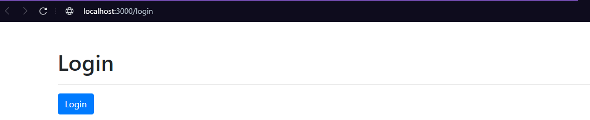
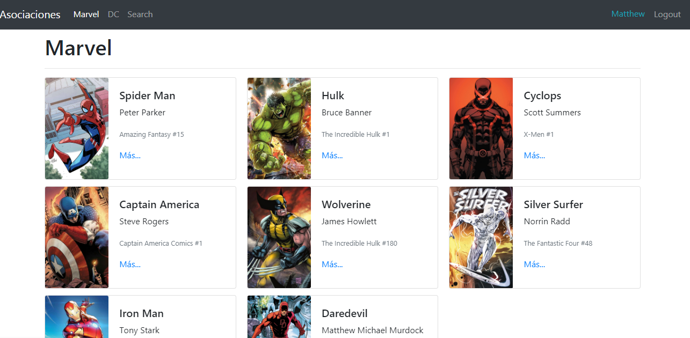
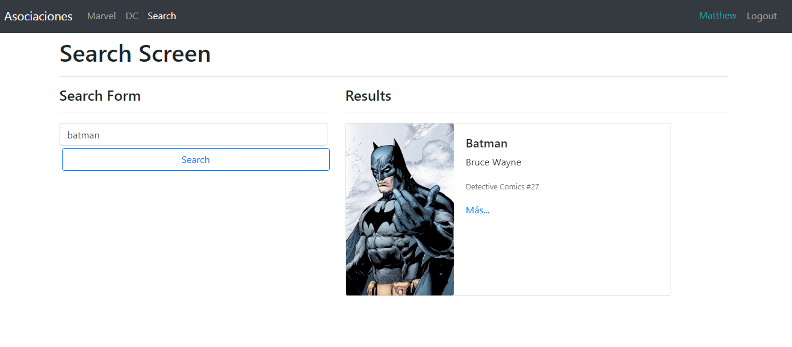

# heroes-app

on live version [here](https://heroes-app-ten.vercel.app/login)

## Table of Contents

- [About](#about)
- [Getting Started](#getting_started)
- [Usage](#usage)
- [Contributing](../CONTRIBUTING.md)

## About <a name = "about"></a>

This is a small project in which path protection is used, it allows searching within the components and goes a bit deeper into the handling of redux, despite not being necessary for use, here the basic structure is created

## Getting Started <a name = "getting_started"></a>

Download with

```
git pull https://github.com/mattseidel/HeroesApp
```

### Prerequisites

What things you need to install the software and how to install them.

```
Give examples
```

### Installing

Once repocitory download

```
npm install
```

for installing all dependencies, once done just

```
npm start
```

## Usage <a name = "usage"></a>

when you start the project this will be the first view

[]()

since is a protected view example, not user is used here, just click login, and this will take you this view

[]()

you can change [here](src/components/login/LoginScreen.jsx) just change 'Displayed name' to your name

you can search data about your favorite hero on search page,
[]()

and for last, Logout and login again! the application know what was the last page you visited or tried to visit, and after login, you will be redirected to there
